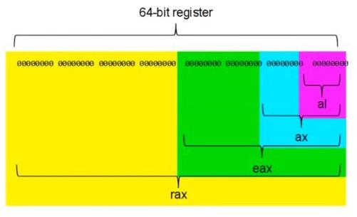

# Introduction To Assembly (asm) Language
Assembly language is a low level language that provides direct control over the hardware. It serves as an interface between high-level languages (like python or C) and machine code (the binary code that CPU understands)

## 1. What Is Assembly Language?
Assembly language consists of human-readable instructions that are mapped to machine code instructions. Each line in an assembly program corresponds to an instruction that the CPU can execute.
### 1.1 Machine Code Vs Assembly
- **Machine Code**: Binary instructions that the CPU directly executes (eg: `11001001 00000001`).
- **Assembly Code**: A human readable representation of machine code using mnemonics (eg: `MOV RAX, 1`).
### 1.2 Why Even Use assembly?
- **Control**: Provides fine-grained control over the CPU, which is essential in systems programming, performance-critical applications, and device drivers.
- **Efficiency**: Allows for highly optimized programs in terms of speed and size.
- **Learning Architecture**: Writing assembly helps developers understand how the CPU, memory, and other hardware components fit together.
- **Old saying**: "If you know assembly, every piece of software is open source"

## 2. Assembly Language Structure
A program written in assembly language generally consists of three sections. These three sections are:
### 2.1 Data Section
This section consists of initialized data or constants that is stored some where in the memory.
```asm
section .data
    msg db "Hello, world", 0xA      ; defines a string "hello, world\n" where each char takes one B in memory
                                    ; NOTE: comments in asm are written after semicolon(;) symbol
                                    ; There are already two comments written above.
                                    ; It is of course not necessary to write comments or ;
```
### 2.2 BSS Section
The BSS (Block Started Symbol) section is used for declaring variables that will be initialized later (uninitialized data).
```asm
section .bss
    buffer resb 64      ; reserves 64 bytes which can be initialized later
```
### 2.3 Text Section
This section contains the code that will be executed by the CPU. It typically starts with a `global _start` or `global main` directive to indicate the program entry point.
```asm
section .text
    global _start       ; directive to indicate the entry point of the program.
                        ; of course these sections go further (as per requirement)
```

## 3. Assembly Language Syntax
The syntax of assembly language depends on the specific architecture (eg: X86, ARM, etc).
In x86_64 assembly:
- **Instruction Mnemonics**: Represents CPU instructions (`MOV`, `ADD`, `PUSH`, `jmp`, etc)
- **Operands**: Specify the data on which the instructions operate (registers, memory locations or immediate values).
  - example:
    - `MOV RAX, 1` moves the value 1 into the RAX register.
- **Directives**: Instructions for the assembler and linker that do not correspond to machine code (example:`global`, `section`, etc)

## 4. Registers For Assembly
Assembly involves working directly with **CPU Registers** (really small and really fast storage areas built into a CPU)
These registers comes in various sizes according to the system architecture. A machine that follows x86_64 architecture, would have registers 8 Bytes or 64 bits long.
There registers are classified into these (64 bit version):
1. **General Purpose Registers**:
   - `RAX`, `RBX`, `RCX`, `RDX`
2. **Index Registers**:
   - `RSI`, `RDI`
   - `RBP` - Base pointer
   - `RSP` - Stack pointer
3. **Integer Registers**:
    - `R8`, `R9`, `R10`, `R11`, `R12`, `R13`, `R14`, `R15`
4. **Instruction pointer**:
   - `RIP` - Holds the address of the next instruction to be executed.

Each of these registers (64 bit version) are made up of their smaller versions (8 bits, 16 bits and 32 bits) with their own names and sizes.
These are:
s. No|64 bit machine |32 bit machine |16 bit machine |8 bit machine|
-----|---------------|---------------|---------------|-------------|
1    | RAX           | EAX           | AX            | AL          |
2    | RBX           | EBX           | BX            | BL          |
3    | RCX           | ECX           | CX            | CL          |
4    | RDX           | EDX           | DX            | DL          |
5    | RDI           | ESI           | SI            | SIL         |
6    | RSI           | EDI           | DI            | DIL         |
7    | RBP           | EBP           | BP            | BPL         |
8    | RSP           | ESP           | SP            | SPL         |
9    | R8            | R8D           | R8W           | R8B         |
10   | R9            | R9D           | R9W           | R9B         |
11   | R10           | R10D          | R10W          | R10B        |
12   | R11           | R11D          | R11W          | R11B        |
13   | R12           | R12D          | R12W          | R12B        |
14   | R13           | R13D          | R13W          | R13B        |
15   | R14           | R14D          | R14W          | R14B        |
16   | R15           | R15D          | R15W          | R15B        |
17   | RIP           | EIP           | IP            | (Varies)    |



Size comparison of a register

### Overview Of 64 Bit Registers (Holds True For Their Smaller Versions)

#### **Generral-Purpose Registers(GPRs)**:
1. `RAX`: **Accumulator register** (used in arithmetic operations and function return values).
2. `RBX`: **Base register** (sometimes used to hold data or memory addresses).
3. `RCX`: **Counter register** (often used for loops and shifts).
4. `RDX`: **Data register** (used in arithmetic and I/O operations).
5. `RDI`: **Destination index register** (commonly used in memory copying and string operations)
6. `RSI`: **Source index register** (commonly used in memory copying and string operations)
7. `RBP`: **Base pointer register** (points at the base of the current stack frame)
8. `RSP`: **Stack pointer register** (points at the top of the current stack)
#### **Extended General-Purpose Registers**:
9. `R8`: Additional general-purpose register
10. `R9`: Additional general-purpose register
11. `R10`: Additional general-purpose register
12. `R11`: Additional general-purpose register
13. `R12`: Additional general-purpose register
14. `R13`: Additional general-purpose register
15. `R14`: Additional general-purpose register
16. `R15`: Additional general-purpose register
#### **Special-Purpose Register**:
17. `RIP`: Instruction pointer (points to the address of the next instruction to be executed).

## 5. Addressing Modes
Addressing modes defines how operands are accessed. Common addressing modes in `x86_64` include:
- **Immediate**: The operand is a constant value
- **Register**: The operand is a register
- **Memory**: The operand is at a memory address or the memory address itself

### More On Immediate values:
Immediate values are of four types:
- Numeric constant
    ```asm
    ; Numeric constants
        mov rax, 200            ; decimal
        mov rax, 0200           ; still decimal
        mov rax, 0200d          ; explicitly decimal
        mov rax, 0d200          ; explicitly decimal

        mov rax, 0c8h           ; hex
        mov rax, 0hc8           ; still hex
        mov rax, $0c8           ; still hex: 0 is req
        mov rax, 0xc8           ; hex again

        mov rax, 310q           ; octal
        mov rax, 0q310          ; octal again
        mov rax, 310o           ; octal again
        mov rax, 0o310          ; octal yet again

        mov rax, 11001000b      ; binary
        mov rax, 0b11001000     ; binary again
        mov rax, 11001000y      ; binary yet again
        mov rax, 0y11001000     ; binary yet again
        mov rax, 0b1100_1000    ; above examples can have undersores too
    ```
- Character constant
    ```asm
        mov al, 'a'     ; moves the ASCII valeu of 'a' that is 97 (takes one B) into 8 bit version of rax register
    ```
- String constant
    ```asm
        db 'hello'                  ; defines a string literal where each char takes one Byte
        db 'h', 'e', 'l', 'l', 'o'  ; equivalent character constants
        db 'hello', 0x0             ; defines a string literal ending with null char where each char takes one Byte
        dd 'hello'                  ; defines a doubel word string literal where eachc char takes 4 Bytes
                                    ; We can also use " " to define strign constants, but using ' ' is a good and common practice.
    ```
- Floating point constant
    ```asm
        db -0.2             ; quarter precision
        dw 1.2              ; half precision
        dd 1.222_222_222    ; underscores are permitted
    ```
### Some Rules In Addressing Modes:
- `register` to `register` **allowed**.
- `memory` to `register` **allowed**.
- `register` to `memory` **allowed**.
- `memory` to `memory` is **not allowed**.

## 6. Assembly Syntax/Formats
When writing assembly code, it's important to know that there are different syntaxes or formats depending on the assembler and the target platform. Two of the most commonly used assembly formats are `Intel syntax` and `AT&T syntax`. These formats differ in how instructions and operands are structured, and how registers and memory addresses are referenced. We will mostly be working with `Intel syntax`.

### 6.1 **Intel Syntax**
Intel syntax is widely used in **x86** and **x86_64** programming. It is considered more human-readable and intuitive for beginners, and is the default syntax in assemblers like `NASM`.
### Key Characteristics:
- **Operand Order**: The destination comes before the source operand (i.e. `MOV destination, source`).
- **Registers**: Written as plain register names (eg: `RAX`, `RBX`).
- **Memory Access**: Memory operands are enclosed in square brackets [] (eg: `[rax]` for memory location stored in `RAX` register).
    ```asm
        mov rax, rbx    ; move the value of rbx into rax
        mov rax, 5      ; move the value 5 into rax
        mov [rax], rbx  ; store the value of rbx into the memory addr pointed to by rax
    ```

### 6.2 **AT&T Syntax**
AT&T syntax is often used in **Unix/Linux environments**, especailly with tools like `GAS(GNU Assembler)`. It differs significantly from Intel syntax in terms of the order of operands and other conventions.
### Key Characteristics:
- **Operand Order**: The source comes before destination operand (i.e `MOV source, destination`).
- **Changes In Instructions**: Instructions such as `mov` are explicitly told to move how many Bytes or bits.
  - `movb` -> move Byte (8 bits)
  - `movw` -> move word or 2 Bytes (16 bits)
  - `movl` -> move long or 4 Bytes (32 bits)
  - `movq` -> move quadword or 8 Bytes (64 bits)
- **Registers**: Register names are prefixed with `%` (eg: `%RAX`, `%RBX`).
- **Immediate Values**: Immediate values are prefixed with `$` (eg: `$1`, `0x4c00`).
- **Memory Access**: Memory operands are enclosed in parentheses, and the scale, index, and base addressing modes are written in a specific format(i.e `(%RAX)`).
    ```asm
        movq    %rax, %rbx      ; move the value of rax into rbx (movq for move quadword)
        movq    $5, %rax        ; move the value 5 into rax (movq for move quadword)
        movq    %rbx, (%rax)    ; move the value of rbx into the memory address pointed by rax
    ```

### Key Differences Between `Intel syntax` And `At&t syntax`
|Feature            |Intex syntax           |AT&T syntax                       |
|-------------------|-----------------------|----------------------------------|
|operand order      |Destination, Source    |Source, Destination               |
|Register names     |No prefix              |Prefixed with `%`                 |
|Memory access      |Square brackets        |Parentheses `(%rax)`              |
|Immediate values   |No prefix              |Prefixed with `$`                 |
|Instruction size   |Implied (eg `mov`)     |Explicit (eg `movq` for 64 bit)   |

### 6.3 Switchting Between Syntaxes In Assemblers
You might come across a situation where you have to switch between Intel and AT&T syntax depending on the assembler or dev env that you are using.
#### 6.3.1 Using NASM:
**NASM** defaults to `Intel syntax`. It doesn't directly support `AT&T syntax`, so you'll have to stick with intel syntax while woking with NASM.
#### 6.3.2 Using GAS (GNU Assembler):
**GAS** defaults to `AT&T syntax`, but you can easiy switch to `Intel Syntax` using specific assembler options. To use `Intel syntax` in GAS, you can add `.intel_syntax` directive in your code or pass the `-masm=intel` flag while assembling.

### 6.4 Switching In GDB (GNU Debugger):
You can switch the assembly syntax displayed in `GDB (GNU Debugger)` between Intel and AT&T. The default syntax is AT&T.
- To switch to Intel syntax:
  - `set disassembly-flavor intel`
- To switch back to AT&T syntax:
  - `set disassembly-flavor att`