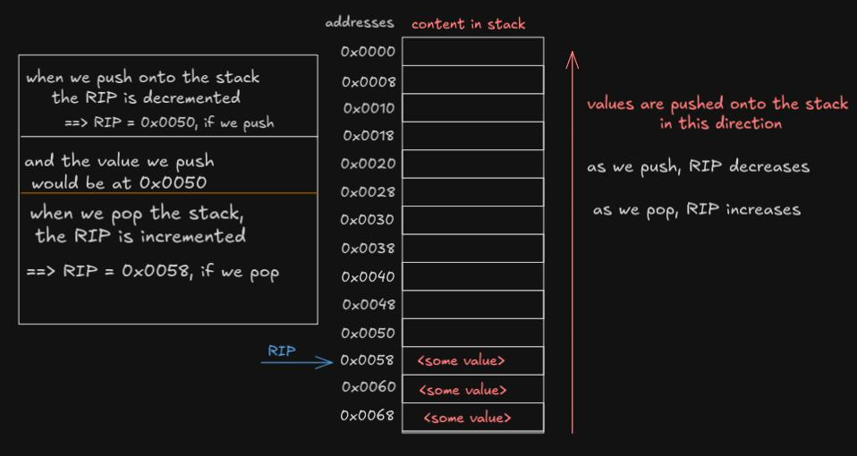
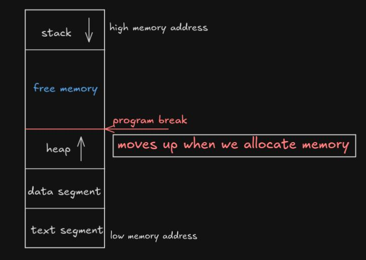

# Virtual Memory In Assembly (Stack, Heap, and Segments)
In this tutorial, we will go over **Virtual Memory** in assembly.

## 1. Introduction to Virtual Memory:
- **Virtual Memory** is a memory management technique used by modern operating systems to create the illusion of a large, continuous memory space for each process, regardless of the actual size of the physical RAM.
- It allows each process to have it's own isolated memory address space, preventing it from accessing another process's memory. This isloation ensures process security and memory management efficiency.
- Key Benefits:
  - **Isolation**: Each process gets its own virtual address space, so they don't interfere with each other.
  - **Larger Address Space**: Processes can use more memory than is physically available by using disk storage (paging)
  - **Efficient Use Of Memory**: Virtual memory can allocate memory dynamically and only load the parts of the program that are in use.

## 2. Virtual Memory Segmentation
Virtual memory is divied into different regions, or segments, each with specific role. These different regions are:
- **Code Segment (Text Segment)**:
  - Stores the executable instructions of the program (read-only)
  - Contains instructions that are mapped as **read-only** to prevent accidental or malicious modifications.
  - Example: The compiled machine code for functions.
- **Data Segment**:
  - Stores global and static variables that are intialized in the program.
  - Divided into **initialized** and **uninialized** parts (explained next).
- **BSS Segment**:
  - Holds uninitialized global and static variables.
  - The operating system initializes this memory to zero.
  - Size increases when more variables are declared.
- **Heap Segment**:
  - Used for dynamic memory allocation. Grows **upwards** in virtual memory as new memory is requested.
  - Explicitly managed by the programmer via system calls or library functions (`malloc` in C).
- **Stack Segment**:
  - Used to store local variables, function arguments, return addresses, and control information.
  - Grows **downwards** in memory (from higher address to lower address).
  - Managed automatically by the CPU using `push` and `pop` operations.

## 3. The Stack in Virtual Memory
The **stack** is a section of memory used for temporary storage during function execution.

### 3.1 Characteristics of stack:
- **LIFO** (**Last In, First Out**): The last value pushed onto the stack is the first one to be removed (popped off).
- **Automatic Management**: The CPU manages the stack as you make function calls and return from them.
- **Local Storage**: Function arguments, return addresses, and local variables are stored onto the stack.
- **Stack Frames**: Each function call creates a new stack frame that contains the function's local variables and return address.

### 3.2 Stack Operations:
- Pushing onto the stack:
  - Data is placed on the top of the stack using `push` instrucion.
  - The stack pionter `RSP` is decremented and the data is stored at the new top of the stack.
  - Example:
    ```asm
        push rax        ; push the value stored in rax onto the stack.
    ```
- Popping from the stack:
  - Data is popped and retrieved from the top of the stack using the `pop` instruction.
  - The stack pointer `RSP` is incremented and the data is moved from the stack into the given register/memory address.
  - Example:
    ```asm
        pop rax         ; pops the top value from the stack into rax.
    ```
- When we call a function via `call` in asm:
  - Value of `RSP` is decremented (to allocate space on stack), and at the same time, the value of `RIP` is pushed onto the stack.
  - `RIP` is updated such that it points to the first instruction of the called function.
  - The instructions are exeuted and with each execution, the value of `RIP` is updated to point to next instrucion.
  - `ret` is encountered at some point.
  - once `ret` is encountered:
    - `RIP` is incremented and at the same time, the stack is popped back into `RIP`
    - Since, `RIP` has its initial value, it continues execution from the next instruction after the function call.

- Visualizing Stack on a 64 bit machine:
    

## 4. The Heap in Virtual Memory
The **heap** is used for **dynamic memory allocation**, which means the memory is allocated and freed explicitly by the programmer at runtime.

### 4.1 Characteristics of Heap:
- The **heap** grows upwards (lower addresses to upper addresses) opposite to that in stack.
- Memory on the heap must be managed manually, meaning that the programmer needs to allocate and free memory using function like (`malloc` and `free` in C).
- Unlike in stack, the heap can be fragmented, meaning free blocks of memory may be scattered around after frequent allocations and deallcoations.
- In low-level programming, dynamic memory allocation is requested fom the heap using system calls like `brk` or `mmap`.

- Visualizing virtual memory on a 64 bit machine:
    
    

### 4.2 Working With Heap in ASM
- Working of `brk`:
  - syscall number for `sys_brk` = 12
  - `rdi` holds the new address of program break.
    - if rdi holds 0:
      - current program break is returned in `rax`
  - to increase the program break by x number of bytes
    - rdi = current program break + x
  - syscall is invoked
  - the new program break is returned in rax

```asm
    section .data
        increment db 0x1000     ; Increase heap by 4096 bytes (one page size)
    
    section .text
        global _start

    _start:
        ; Step 1: Get the current program break (heap end)
        mov rax, 12            ; sys_brk syscall number (12)
        xor rdi, rdi           ; rdi = 0 to get the current program break
        syscall

        ; Step 2: Store the current break address
        mov rbx, rax           ; Save the current program break in rbx

        ; Step 3: Add the increment to the current break to increase the heap
        add rbx, [increment]   ; Add 4096 bytes to the current break

        ; Step 4: Set the new program break
        mov rax, 12            ; sys_brk syscall number (12)
        mov rdi, rbx           ; rdi = new break address
        syscall                ; invoking the ssycall

        ; Step 5: Exit the program
        mov rax, 60            ; sys_exit syscall number (60)
        xor rdi, rdi           ; Exit code 0
        syscall
```