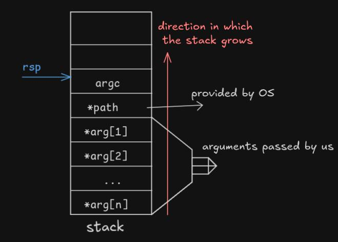
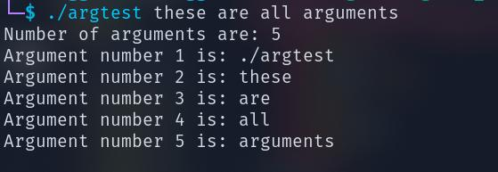

# Command Line Arguments
In this tutorial we will learn how to pass command line arguments while executing our program, how they are stored in the stack and how to print them onto the screen.

## What Are Command Line Arguments?
When a program is executed from the command line, some arguments can be passed to it. After the name (path) of/to the program to execute, the arguments are separated by white spaces.
All the arguments which are passed into the function are strings and not integers.

```./argtest argument1 argument2 argument3```

Here:
- `./argtest` is the **path** to the program we want to execute.
- `argument1` is the **first argument** passed by us.
- `argument2` is the **second argument** passed by us.
- `argument3` is the **third argument** passed by us.
and so on...

## Arguments on the stack:
When the program is executed, the arguments are automatically loaded onto the stack in this order:
- At the top of the stack is the number of arguments `argc`.
  - `argc` is always at least one.
- Next items in the stack are pointers to zero-terminated strings, starting with:
  - `path`
  - then, each of the individual argument passed by a user.

### Visualizing Arguments on the stack:


|argument   | value it stores   |
|-----------|-------------------|
|argc       | 4                 |
|*path      | "./argument"      |
|*arg1      | "argument1"       |
|*arg2      | "argument2"       |
|*arg3      | "argument3"       |

The first argument passed by the user would actually be the second argument present in the stack
in general, 

`n'th argument passed by user = n+1'th argument in stack`

## Program to Print CLI Arguments On The Screen
```asm
; let the file name be argtest.asm

%macro printDigit 1                            ; defining a macro to print a digit passed to it
    mov rax, %1                                ; load the passed digit into rax
    add rax, 48                                ; convert the digit to its ASCII value by adding 48
    mov [digit], rax                           ; write value of rax into the reserved 8 bytes of 'digit'
    mov rax, 1                                 ; prepare for sys_write (system call)
    mov rdi, 1                                 ; file descriptor for stdout
    mov rsi, digit                             ; load pointer to 'digit' variable
    mov rdx, 8                                 ; load number of bytes to write (starting from pointer) into rdx
    syscall                                    ; invoke the syscall
%endmacro                                      ; end the macro definition

%macro printNline 0                            ; defining a macro to print a newline character
    mov rax, 1                                 ; load 1 into rax (syscall number for sys_write)
    mov rdi, 1                                 ; load 1 into rdi (file descriptor for stdout)
    mov rsi, nline                             ; load pointer to 'nline' character into rsi
    mov rdx, 1                                 ; load 1 (number of bytes to write) into rdx
    syscall                                    ; invoke the syscall
%endmacro                                      ; end the macro definition

%macro printString 1                           ; defining a macro to print a string (pointer to string is passed)
    mov rsi, %1                                ; load the pointer to string into rsi
    xor rcx, rcx                               ; clear rcx to count the length of the string
    %%getLenLoop:                              ; loop to calculate the length of the string
        mov al, [rsi + rcx]                    ; move value pointed by rsi + rcx into lower byte of rax (al)
        test al, al                            ; perform a bitwise AND between al and al, result zero iff al = 0
        jz %%done                              ; if result of test = 0, jump to %%done label
        inc rcx                                ; increment rcx if al is not 0
        jmp %%getLenLoop                       ; jump to %%getLenLoop to execute a loop
    %%done:                                    ; definition of %%done label, executed when al = 0
        mov rax, 1                             ; load 1 into rax (sys_write)
        mov rdi, 1                             ; load 1 into rdi (stdout)
        mov rsi, %1                            ; load pointer to string into rsi
        mov rdx, rcx                           ; load number of bytes to write (length) into rdx
        syscall                                ; invoke the syscall
%endmacro                                      ; end the macro definition

%macro exit 0                                  ; macro to exit the program
    mov rax, 60                                ; load 60 into rax (sys_exit)
    xor rdi, rdi                               ; load 0 into rdi (exit code)
    syscall                                    ; invoke the syscall
%endmacro                                      ; end the macro definition

section .data
    argc_str db 'Number of arguments are: ', 0 ; string literal for displaying the argument count
    argn_str db 'Argument number ', 0          ; string literal for displaying each argument number
    ending db ' is: ', 0                       ; string literal for formatting output

    nline db 10                                ; label to one B which holds the newline character's ASCII value

section .bss
    digit resb 8                               ; reserving 8 bytes under name 'digit' for digit storage
    argc resb 8                                ; reserving 8 bytes under name 'argc' for argument count

section .text
    global _start

_start:
    pop rax                                    ; pop the stack into rax (rax holds argc from stack) and increment rsp
    mov [argc], rax                            ; write the value of rax into 'argc' (pointer to argc in memory)
    printString argc_str                       ; call the macro with the pointer to string (argc_str)
    printDigit [argc]                          ; call the macro with the value in 'argc' to print it
    printNline                                 ; call the macro to print the newline character

printArgs:                                     ; label used to print the arguments in the stack
    xor rbx, rbx                               ; clear rbx to use it as a counter
    printArgsLoop:                             ; start of the loop
        cmp rbx, [argc]                        ; compare the value of rbx with the value in 'argc'
        jge printArgsDone                      ; if rbx >= value in 'argc', jump to label printArgsDone
        inc rbx                                ; if rbx < *argc, increment rbx by 1
        printString argn_str                   ; call macro with pointer to string (argn_str) to print it
        printDigit rbx                         ; call macro with the value in rbx to print that digit
        printString ending                     ; call the macro with pointer to string (ending) to print it
        pop r15                                ; pop the stack into r15 (r15 has the pointer to the first argument, i.e., path)
        printString r15                        ; call the macro to print the first argument string
        printNline                             ; print the newline character
        jmp printArgsLoop                      ; jump back to printArgsLoop to execute a loop
    printArgsDone:                             ; executes if rbx >= value in 'argc'
        exit                                   ; call the exit macro to exit the program
```
### Output of the code


### Explanation of The Code Given Above
#### Segments/Sections defined:
1. section .data
   - Defining four null terminated strings, where in each string, each character takes one B.
   - Define a label to one B which is initialized with 10 (ascii value or '\n').

2. section .bss
   - Reserve 8 Bytes under the name `digit` to store ASCII value of digits.
     - `digit` points to the base address of the reserved memory.
   - Reserve 8 Bytes under the name `argc` to store argc (from stack).
     - `argc` points to the base address of the reserved memory.

3. section .text
   - This segment uses the macros that we have defined, so let's first take a look at those macros.

#### Macros defined:
1. `printDigit`
   - Takes a single digit as an argument.
   - Moves that digit in rax.
   - Add 48 to rax.
   - Load 8 B of rax into the reserved 8 bytes of `digit`.
   - Write the digit to stdout using sys_write syscall.

2. `printNline`
   - Doesn't take any argument.
   - Prints a new line character to move to the next line.

3. `printString`
   - Takes the pointer to a null terminated string which is to be printed as an argument.
   - Load the argument (pointer to null terminated string) into rsi.
   - Clear rcx register (load 0 into rcx) to cound the length of the string.
   - Create a local label `%%getLenLoop`
     - load the value (char's ascii val) pointed by [rsi + rcx]
     - test al with al, sets `zf` flag if and only if al = 0
     - jump to `%done` label if `zf` flag is set
     - else:
       - increment rcx by 1
       - jump back to `%%getLenLoop` to create a loop
    - Once the `zf` flag is set, jump to `%done` label and execute instructions below it:
      - print the string by loading the length (value in rcx) into rdx

4. `exit`
   - Doesn't take any argument.
   - Exits the program using `sys_exit` syscall.

#### Continuation of text section
1. `pop rax` Pop the stack into rax
   - The value at the top of the stack is the number of arguments (argc).
   - So, this instruction will load the value at the top of the stack into `rax`.
   - The `rsp` would also be incremented since we are popping from the stack and stack grows **downwards**.

2. `mov [argc], rax` Load the 8 Bytes of `rax` into the reserved 8 Bytes of `argc`.

3. `printString argc_str` Call the printString macro with `argc_str` as an argument.

4. `printDigit [argc]` Call the printDigit macro with the value that argc points to.

5. `printNline` Call the printNline macro.

6. `printArgs:` Defines a label to print CLI arguments present in the stack.

7. `xor rbx, rbx` Clears rbx register to use it as a counter.
   - The reason why we are using `rbx` here is because it is not overwritten during a syscall.

8. `printArgsLoop:` Defines a label which is used for loop to print CLI arguments

9. `cmp rbx, [argc]` Compare the value in `rbx` by the value that `argc` is pointing to.

10. `jge printArgsDone` If value in `rbx` >= to value that `argc` is pointing to, jump to `printArgsDone` label

11. if value in `rbx` < value that `argc` is pointing to:
    - `inc rbx` increment the value of rbx by 1
    - `printString argn_str` print the string that `argn_str` points to
    - `printDigit rbx` print the digit that rbx currently has
    - `printString is` print the string that `is` points to
    - `pop r15` pop the stack into `r15` ==> `r15` now has the pointer to a null terminated strings (arguments in stack)
    - `printString r15` print the string that r15 is pointing to
    - `printNline` print a new line character
    - `jmp printArgsLoop` jump back to `printArgsLoop` to create a loop

With each iteration of the loop `printArgsLoop`:
- value of `rbx` changes (to eventually terminate the loop)
- with each iteration, pointer to a new to null-terminated string is popped off of the stack into r15 which is then printed.